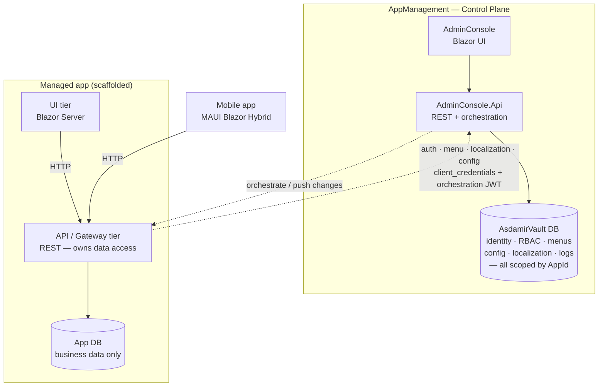

# Asdamir

**A security-first application framework for .NET 10 + Blazor — and a ready-to-run control plane that registers, configures and operates every app you build on it.**


> **Zero to a running enterprise app** — generate a feature, start the app, see it in the menu. **~46 seconds.**

```bash
# Prereqs: .NET 10 SDK + SQL Server (localhost:1433)
dotnet tool install -g Asdamir.Tools
mkdir my-apps && cd my-apps
asdamir new app DemoApp --mode free      # secrets + DB + migrations, all automatic
cd DemoApp && ./restart-demoapp.sh       # → https://localhost:7010, sign in with the starter admin
asdamir new feature Product --fields "Name:string,Price:decimal,Stock:int"
./restart-demoapp.sh                     # → Product in the menu, CRUD page
```

Asdamir gives you two things at once:

1. **A framework** (five NuGet packages) so a new line-of-business app starts with auth, RBAC, validation, error handling, localization, configuration, observability, background jobs, a transactional outbox, opt-in billing and a FluentUI component library already wired and hardened — not as a to-do list.
2. **AppManagement** — a real control plane (Blazor admin console + REST API) that manages *all* your apps from one place: central identity, permissions, menus, localization, configuration and logs, scoped per app.


📚 **Docs:** [docs.asdamir.com](https://docs.asdamir.com) · 🧩 **Offline & AI-free** — the CLI needs no cloud and no AI; an optional [Claude Code](https://docs.asdamir.com) skill/agent layer is there if you want it.

> Status: stable. Open-core packages on nuget.org — `Asdamir.Core` `1.3.0`, `Asdamir.Data` · `Asdamir.Web` · `Asdamir.Payments` `1.2.x`, `Asdamir.Tools` `1.3.11`. Production-ready; semantic versioning — breaking changes bump the major. The production-readiness features below are in place.

---

## Why use Asdamir?

### For developers & teams

- **Skip months of plumbing.** Authentication (JWT + 2FA + refresh-token rotation with reuse detection), two-tier RBAC, validation, RFC-7807 error handling, DB-backed localization & configuration, structured logging, a transactional outbox, Hangfire jobs and an enterprise FluentUI component library all ship working. You write features, not infrastructure.
- **Secure by default, not bolted on.** Safe defaults everywhere: CSP nonce, security headers, request rate limiting, AES-256-GCM encryption with PBKDF2, ASP.NET Data Protection key persistence, audit logging, PII-safe logging. A static **audit-lint** gate fails the build on anti-patterns (sync-over-async, silent failures, leaked API surface, unsafe defaults).
- **Scaffold in seconds — with tests.** `asdamir new app`, `new mobile` (MAUI Blazor Hybrid), `new entity`, `new page`, `new feature` (one command: entity + page + menu/permission), `new module` emit code that already follows the framework's audited conventions — entity → DTO → repository → service → controller → **tests** → migration. Every scaffolded entity ships with **working tests** (CRUD round-trips, validation, and an API auth-guard that asserts the endpoint returns `401` without a token) that run **DB-free**. You generate a *tested* app, not just an app.
- **Observability that actually helps.** OpenTelemetry traces **and** metrics (incl. SQL/Dapper DB spans) over OTLP, Kubernetes-style liveness/readiness health probes, correlation-ID propagation, and Serilog to console / file / database. Point it at a collector and you get full-stack traces end-to-end.
- **Built to run in production.** A journaled, idempotent migration runner; encryption-key rotation tooling; DB-backed (scale-out) rate limiting; restart-safe Data Protection keys; offline-resilient mobile. **0-warning builds** (`TreatWarningsAsErrors` + latest analyzers) and **650+ automated tests**.

### For organizations

- **One control plane for many apps.** This is the differentiator. **AppManagement** registers, configures and orchestrates every app built on the framework. Identity, roles, permissions, menus, localization, configuration and logs live **once** (in the `AsdamirVault` database, scoped by `AppId`) and are administered from a single console — not re-implemented per app. Onboard a new app in minutes.
- **Consistency & governance across teams.** Every app follows the same audited security model and the same **layered architecture** (the API tier owns all data access; the UI never touches the database). `audit-lint` enforces the conventions so quality doesn't drift between teams.
- **Lower total cost of ownership.** A shared, hardened foundation + central management means less duplicated infrastructure, fewer security mistakes, and faster onboarding of both apps and people.
- **Compliance-friendly.** Append-only audit trail, at-rest encryption with documented **key rotation**, secrets never in `appsettings.json`, and PII masking in logs.
- **Multi-tenant & multi-company** from day one; ship the same app to web **and** mobile (MAUI) sharing one identity/localization/config backend.

---

## Architecture



- **Central, per-app data.** Management tables (`Users`, `Roles`, `Permissions`, `Menus`, `AppConfigurations`, `LocalizationResource`, `AppLog`, …) exist once in `AsdamirVault` with an `AppId` column. A scaffolded app's own database holds **only its business data**; it reads identity / menus / config / localization through AppManagement's API.
- **Layered architecture.** Every app has its own REST API tier that owns all data access (queries, migrations, background jobs). The UI/client tier only calls the API over HTTP — DB credentials never reach the UI.
- **Two-tier RBAC.** Admin-pool roles (console operators) **plus** a per-app admin × app × role matrix, so an operator only reaches the apps they're granted.

---

## What's in the box

| Layer | What it is |
|---|---|
| **Framework** (`src/`) | Five NuGet packages — `Asdamir.Core`, `Asdamir.Data`, `Asdamir.Web`, `Asdamir.Payments`, `Asdamir.Tools` — referenced from any .NET 10 app. |
| **AppManagement** (`AppManagement/`) | `Asdamir.AdminConsole` (Blazor Web App) + `Asdamir.AdminConsole.Api` (REST backend). The control plane: app registry, identity/RBAC, localization, configuration, outbox, jobs and monitoring across managed apps. |

### Framework packages

| Package | Namespace | Contents |
|---|---|---|
| **Asdamir.Core** | `Asdamir.Core.*` | Models, DTOs, contracts, modules, multi-tenancy, error handling, validation, JWT, AES-GCM encryption, authorization |
| **Asdamir.Data** | `Asdamir.Data.*` | Dapper multi-DB repositories, DB-backed configuration, Hangfire jobs, transactional outbox + dispatchers |
| **Asdamir.Web** | `Asdamir.Web.*` | Blazor + FluentUI components, API-backed localization, web security (JWT / Data Protection / CSP / rate limiting) |
| **Asdamir.Payments** | `Asdamir.Payments.*` | Payment rails: Paddle (Merchant-of-Record) + crypto, webhook signature verification, subscription lifecycle |
| **Asdamir.Tools** | `Asdamir.Tools.*` | The `asdamir` CLI: scaffolding, `audit lint`, `db apply`, `rollback`, `secrets`, `app register` |

---

## Production-readiness (built in)

| Concern | What you get |
|---|---|
| **Database migrations** | `asdamir db apply` — journaled, idempotent, incremental runner (`dbo.__SchemaMigrations`); re-runs apply only what's new |
| **Secrets & key rotation** | `asdamir secrets rotate-key` re-encrypts at-rest secrets old-key → new-key (transactional, idempotent); `secrets encrypt` for config values — [runbook](docs/secret-rotation.md) |
| **Health probes** | `/health/live` (liveness) + `/health/ready` (readiness — gates traffic on the DB, Dapper mode) on every API tier; liveness on the UI hosts. k8s-ready |
| **Tracing & metrics** | OpenTelemetry over OTLP — ASP.NET Core + HttpClient + .NET runtime + **SQL/Dapper** spans, correlated across tiers (opt-in via an OTLP endpoint) |
| **Scale-out** | DB-backed rate limiting (counters aggregate across instances); DB-backed refresh-token store; restart-safe Data Protection keys |
| **Mobile** | Offline-resilient MAUI app — network failures never crash the UI; last-known data served from a local SQLite cache |

---

## Quick start

### Try it in 5 minutes (no clone, no database)

Install the CLI from nuget.org and scaffold a fully wired app — it builds with **0 warnings** and its generated tests pass **DB-free**:

```bash
dotnet tool install -g Asdamir.Tools                        # provides the `asdamir` command
asdamir new app DemoApp --mode free --no-db                 # files only — no SQL Server needed
cd DemoApp
asdamir new entity Invoice --fields "Number:string,Total:decimal,IsPaid:bool" --no-db
dotnet build DemoApp.sln                                    # 0 warnings
dotnet test  DemoApp.sln                                    # generated tests pass — no SQL Server needed
```

> For a **running** app (with a database), use the canonical flow at the top of this README — `new app DemoApp --mode free` sets up secrets + DB + migrations automatically, then `./restart-demoapp.sh`.

### Build the repo from source

**Prerequisites:** .NET 10 SDK; SQL Server (LocalDB or remote) for the `AsdamirVault` catalog. The test suite runs fully in-memory — no database or secrets needed.

```bash
# Restore, build, test
dotnet restore Asdamir.sln
dotnet build   Asdamir.sln -c Release          # 0 warnings (warnings-as-errors)
dotnet test    Asdamir.sln                      # 650+ tests, in-memory
```

**Run the management app against a real database:**

```bash
cd AppManagement/src/Asdamir.AdminConsole.Api
dotnet user-secrets init
dotnet user-secrets set "Persistence:UseInMemory"        "false"
dotnet user-secrets set "ConnectionStrings:AsdamirVault" "Server=...;Database=AsdamirVault;..."
dotnet user-secrets set "Jwt:Key"                        "<64+ byte random>"
dotnet user-secrets set "Security:EncryptionKey"         "<32+ char>"
dotnet run
```

Create the schema with the journaled runner, then sign in as the seeded SuperAdmin:

```bash
asdamir db apply --server <sql> --database AsdamirVault --user <login> --password <pwd> \
  --create-database --migrations AppManagement/db/migrations
```

Migration runbook + first-SuperAdmin seed are provided with AppManagement (the commercial control plane).

**Scaffold a new app:**

```bash
asdamir new app DemoApp          # Server (Blazor) + Gateway (REST API) + DB schema/seed
asdamir new mobile DemoApp       # MAUI Blazor Hybrid app
cd DemoApp                        # then run the rest from the app root — no cd into src/…
asdamir new feature Invoice --fields "Number:string,Total:decimal,IsPaid:bool"   # entity + page + menu, migration applied
asdamir new entity Invoice --fields "Number:string,Total:decimal,IsPaid:bool"    # API-only; migration applied (--no-db to skip)
```

**Free mode.** `asdamir new app <Name> --mode free` scaffolds a **self-contained** app with **no control
plane**: its identity, RBAC, menus, localization and config live in the app's **own** database
(single-tenant), the Gateway **issues and validates its own JWTs**, and logging goes to file + console — so
the app runs standalone with AppManagement not involved. The default (`--mode commercial`) is unchanged: the
control plane owns that data centrally in `AsdamirVault`, scoped per app. **Generate → run:** `new app` asks for
the SQL user + a masked password, then auto-configures the Gateway's dev user-secrets (a CSPRNG `Jwt:Key` +
`Security:EncryptionKey` + the connection string — never in `appsettings.json`) **and creates the database +
applies every migration**, so a free app goes straight to `./restart-<app>.sh`. Pass `--no-db` (or `--no-secrets`)
to scaffold files only. See the free quick-start in
[docs/cli.md](docs/cli.md#asdamir-new-app-free-vs-commercial-mode).

**Billing (opt-in).** `asdamir new app <Name> --billing` adds an **end-user payment page** (plans +
subscription + Paddle checkout) — off by default, commercial mode only. The billing data + payment secret
stay central in `AsdamirVault` (AppId-scoped); the app reaches them through AppManagement and never holds the
secret. Without the flag no billing file is emitted. See [docs/cli.md](docs/cli.md#asdamir-new-app-billing).

### Configuration & secrets

`appsettings.json` holds **non-secret defaults only**. Secrets come from `dotnet user-secrets` (dev) or environment variables (prod):

| Secret | Dev | Prod |
|---|---|---|
| `Jwt:Key` (≥64 byte) | user-secrets | `Jwt__Key` |
| `ConnectionStrings:AsdamirVault` | user-secrets | `ConnectionStrings__AsdamirVault` |
| `Security:EncryptionKey` (≥32 char) | user-secrets | `Security__EncryptionKey` |

---

## CLI — `Asdamir.Tools`

```bash
asdamir <command>                                        # after: dotnet tool install --global Asdamir.Tools
dotnet run --project src/Asdamir.Tools -- <command>      # or from source
```

| Command | What it does |
|---|---|
| `new app` · `new mobile` · `new entity` · `new page` · `new feature` · `new module` | Scaffold apps & code from audited conventions |
| `new feature <Name>` | One command: entity + page + menu/permission seed (optionally applied) — the full-CRUD fast path |
| `rollback <Name>` | Tear down a generated feature (code + DB table + menu/permissions); interactive confirm by default |
| `db apply` | Journaled, idempotent SQL migration runner |
| `secrets rotate-key` · `secrets encrypt` | At-rest key rotation + value encryption |
| `audit lint` | Static anti-pattern gate (run it before every push) |
| `app register` | Register a managed app into AppManagement |

Suppress a single finding with `// audit-lint:ignore AUDxxx` (+ a reason); whole-file opt-out with `// audit-lint:skip-file` in the first 10 lines.

---

## Tech stack

.NET 10 · Blazor + Microsoft FluentUI · Dapper · Hangfire · Serilog · OpenTelemetry · Polly · FluentValidation · MailKit · Twilio · ClosedXML · QuestPDF · System.CommandLine · xUnit + bUnit + FluentAssertions.

---

## Documentation

📚 **Browse the full documentation site: [docs.asdamir.com](https://docs.asdamir.com)** (searchable, ABP-style). The same guides live in [`docs/`](docs/README.md) as readable markdown on GitHub:

- [Getting Started](docs/getting-started.md) · [Architecture](docs/ARCHITECTURE.md)
- Fundamentals: [Authentication](docs/fundamentals/authentication.md) · [Authorization](docs/fundamentals/authorization.md) · [Multi-Tenancy](docs/fundamentals/multi-tenancy.md) · [Validation](docs/fundamentals/validation.md) · [Error Handling](docs/fundamentals/error-handling.md) · [Data Access](docs/fundamentals/data-access.md) · [Configuration](docs/fundamentals/configuration.md) · [Background Jobs](docs/fundamentals/background-jobs.md) · [Outbox](docs/fundamentals/outbox.md) · [Localization](docs/fundamentals/localization.md) · [Audit Logging](docs/fundamentals/audit-logging.md) · [Encryption](docs/fundamentals/encryption.md) · [Observability](docs/fundamentals/observability.md)
- Operations: [CLI](docs/cli.md) · [Secret Rotation](docs/secret-rotation.md) · [Mobile](docs/mobile.md) · [Web Security](docs/web-security.md)

---

## Building & contributing

There is **no hosted CI** on this repository (GitHub Actions is disabled for cost), so **verify locally before pushing**:

```bash
dotnet build Asdamir.sln -c Release                              # must be 0 warnings
dotnet test  Asdamir.sln                                         # all green
#   skip the slow generate-and-build scaffold test when you didn't touch templates/framework:
dotnet test  Asdamir.sln --filter "Category!=Scaffold"
dotnet run --project src/Asdamir.Tools -- audit lint --path src
dotnet run --project src/Asdamir.Tools -- audit lint --path AppManagement/src
```

The repo name is `entframework` (kept on purpose); the product/brand is **Asdamir**.

## License

Asdamir is **dual-licensed (open core)**:

- **Open core — LGPL-3.0.** The framework (`Asdamir.Core`, `Asdamir.Data`, `Asdamir.Web`, the
  `Asdamir.Tools` CLI, the UI components, the `.claude/skills` + `.claude/agents`, and the docs) is free
  software under the [GNU LGPL-3.0](LICENSE). You may use it in your own applications — **including
  closed-source, commercial ones** — for free. The only obligation: if you **modify the framework
  itself**, those modifications to the framework must be shared under the LGPL. Your own code that merely
  *uses* Asdamir stays yours.
- **Commercial — AppManagement.** The management/control plane (`AdminConsole` + `AdminConsole.Api`) is
  **not** open source. It requires a separate commercial license (**Team / Business / Enterprise**).
  Copying, distribution, or sublicensing without a license is prohibited. See
  [docs.asdamir.com](https://docs.asdamir.com) for plans, or contact _[placeholder — sales@asdamir.example]_.

**FAQ — "Can I use Asdamir in my own commercial/closed app?"** **Yes.** LGPL-3.0 allows it; you only
have to publish changes you make *to the framework itself*. Building a closed product *on top of* Asdamir
is fine. (AppManagement is the part that needs a commercial license.)

---

### Lisans (Türkçe)

Asdamir **çift lisanslıdır (open core)**:

- **Açık çekirdek — LGPL-3.0.** Framework (`Asdamir.Core/.Data/.Web`, `Asdamir.Tools` CLI, UI
  bileşenleri, `.claude/skills` + `.claude/agents`, docs) [GNU LGPL-3.0](LICENSE) altında özgür
  yazılımdır. Kendi uygulamanda — **kapalı kaynak, ticari olanlar dahil** — ücretsiz kullanabilirsin.
  Tek yükümlülük: **çekirdeğin kendisinde** değişiklik yaparsan, o değişiklikleri LGPL altında açman
  gerekir. Asdamir'i sadece *kullanan* kendi kodun sana ait kalır.
- **Ticari — AppManagement.** Yönetim/kontrol düzlemi (`AdminConsole` + `AdminConsole.Api`) açık kaynak
  **değildir**; ayrı ticari lisans (**Team / Business / Enterprise**) gerektirir. Lisanssız kopyalama,
  dağıtım veya alt-lisanslama yasaktır. Planlar için [docs.asdamir.com](https://docs.asdamir.com);
  iletişim: _[placeholder]_.

**SSS — "Asdamir'i kendi ticari/kapalı uygulamamda kullanabilir miyim?"** **Evet.** LGPL-3.0 buna izin
verir; yalnızca *çekirdekte* yaptığın değişiklikleri açman gerekir. Asdamir'in *üzerine* kapalı bir ürün
inşa etmek serbesttir. (Ticari lisans gerektiren kısım AppManagement'tır.)
